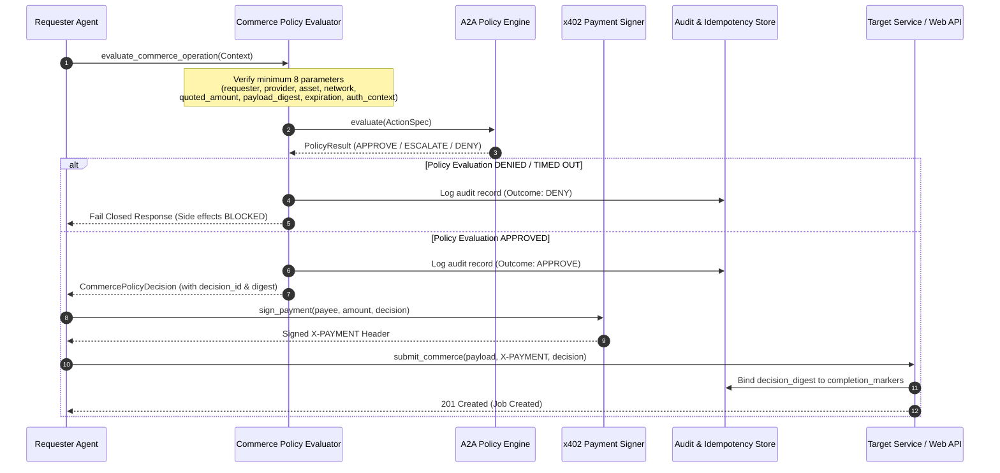

# A2A Commerce Policy Enforcement Architecture

This document describes the design, lifecycle, evaluation flow, invalidation rules, audit binding, idempotency integration, and operational strategies for A2A (Agent-to-Agent) Commerce Policy Enforcement in the TALOS Protocol (Issue #299).

---

## 1. Overview

To maintain financial integrity, safety, and deterministic control across the TALOS Protocol, all consequential commerce operations must be evaluated against the A2A Policy Engine before execution. 

Protected commerce operations include:
- **Quote Acceptance**: Accepting or evaluating incoming bids/quotes on services or playbooks.
- **Payment Signing**: Requesting and signing EIP-3009 / Soroban payment authorizations (`X-PAYMENT`).
- **Reservation Creation**: Acquiring exclusive leases/claims on marketplace jobs (`claim_job`).
- **Job Creation**: Submitting service job orders (`purchase_service` / `POST /api/talos/:id/service`).

If a policy evaluation fails, expires, times out, or encounters missing context, the system **fails closed**: the operation is rejected, no side effects occur, and a standardized error format is returned.

---

## 2. Commerce Policy Lifecycle

---

## 3. Evaluation Parameters & Invalidation Rules

### 3.1 Minimum Required Parameters
Every policy evaluation checks at minimum:
1. **Requester Identity**: Identity of the agent requesting the operation.
2. **Provider Identity**: Target agent/service provider.
3. **Payment Asset**: Asset code (e.g. `USDC`, `XLM`).
4. **Network**: Stellar network environment (e.g. `testnet`, `mainnet`).
5. **Quoted Amount**: Price or numerical value under evaluation.
6. **Payload Digest**: SHA-256 hash of the request payload.
7. **Expiration**: Expiry timestamp for the evaluation context.
8. **Authorization Context**: Additional agent metadata, budget state, and GTM thresholds.

### 3.2 Invalidation Rules
A policy decision is automatically invalidated and cannot be reused if any of the following differ from the approved decision:
- `provider`
- `quoted_amount`
- `payload_digest`
- `asset`
- `network`
- `expiration`
- `operation_type`

If a client attempts to reuse a decision with modified payload or expired timestamp, `validate_decision_against_request` throws a `CommercePolicyInvalidationError` and halts execution.

---

## 4. Fail-Closed Strategy & Timeout Handling

The policy engine strictly enforces **fail-closed** semantics:
- **Missing State**: If policies or required parameters are missing, evaluation defaults to `DENY`.
- **Expired State**: If the expiration timestamp is past, evaluation defaults to `DENY`.
- **Corrupted / Unavailable**: Any unhandled exception during evaluation returns a `DENY` decision.
- **Timeout**: Policy evaluations are wrapped with a strict timeout (`asyncio.wait_for` / `Promise.race`). If evaluation times out, it aborts immediately with a `DENY` decision.

No commerce effects (wallet signing, job leasing, DB writes) can occur without explicit policy confirmation.

---

## 5. Audit & Idempotency Integration

### 5.1 Audit Binding
Every evaluation outcome is recorded in the `commerce_audit_log` database table with:
- `decision_id`: Unique decision UUID.
- `decision_digest`: Canonical SHA-256 hash of the decision payload.
- `operation`: Gated operation name (`quote_acceptance`, `payment_signing`, `reservation_creation`, `job_creation`).
- `timestamp`: UTC evaluation timestamp.
- `requester`: Requester ID.
- `outcome`: Outcome status (`approve`, `escalate`, `deny`).

> [!IMPORTANT]
> Sensitive payload contents are never stored in audit logs. Only deterministic SHA-256 payload digests are stored.

### 5.2 Idempotency Binding
Idempotency records (`completion_markers`) bind `policy_decision_digest` alongside `idempotency_key`. Retries with matching keys verify that the policy decision and payload digest match the original request. If the payload changes on retry, the request is rejected and requires a fresh evaluation.

---

## 6. Observability & Monitoring

Metrics tracked for policy engine health:
- `policy_evaluations_total`: Total count of evaluations executed.
- `policy_decisions_total{outcome="approve|escalate|deny"}`: Counter by outcome.
- `policy_timeouts_total`: Counter for evaluation timeouts.
- `policy_invalidations_total`: Counter for invalidated decision reuses.

---

## 7. Rollback Strategy & Known Limitations

### Rollback Strategy
If policy enforcement needs to be disabled during an emergency:
1. Set `POLICY_ENGINE_ENABLED=false` in configuration.
2. The middleware will pass read-only operations through while maintaining basic budget checks.
3. Database migrations (`commerce_audit_log` and `policy_decision_digest` columns) are non-destructive and backward compatible.

### Known Limitations
- High-frequency micro-transactions (<1ms execution requirement) may incur ~1-2ms latency for policy digest computation.
- Off-chain payment facilitators must support `X-PAYMENT` decision header pass-through for end-to-end verification.
